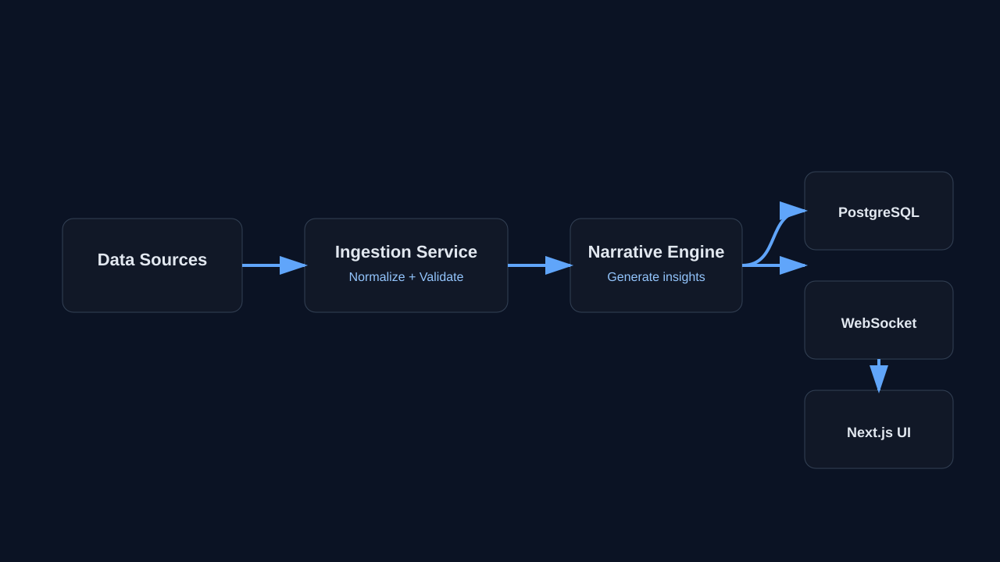
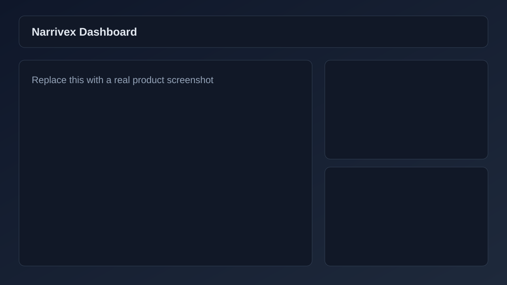

# Narrivex Core

Narrivex Core is a production-ready full-stack TypeScript monorepo that turns raw market movement into clear, real-time narratives.


## About

Modern traders and analysts are overloaded with disconnected charts, feeds, and alerts. Narrivex Core unifies those moving parts into one platform:

- ingest market signals,
- generate contextual AI-supported narratives,
- deliver updates instantly through APIs and WebSockets,
- and surface everything in a focused, responsive dashboard.

## What Problem It Solves

Most market tools tell you what changed, but not why it matters.

Narrivex focuses on interpretation, not just data display.

- Reduces analysis time by converting events into concise narratives.
- Improves situational awareness with live updates and alerting.
- Centralizes authentication, assets, rules, and insights in one workflow.

## Tech Stack (SVG)

### Frontend


### Backend


### Data, Infra, Deployment


## How It Works

### System Flow



### Runtime Flow

1. Market data arrives through ingestion services.
2. Backend normalizes and validates the stream.
3. Narrative engine generates insight text and metadata.
4. Events are persisted in PostgreSQL.
5. APIs return historical and current narratives.
6. WebSocket pushes real-time updates to connected dashboards.
7. Alert rules evaluate thresholds and trigger notifications.

## Product Walkthrough (Screenshots + Video)

### Dashboard Overview



### Alerts and Monitoring


### Demo Video

Add your product walkthrough video URL here:

- https://www.youtube.com/watch?v=YOUR_DEMO_VIDEO_ID

## Project Structure

```text
.
├── docker-compose.yml
├── narrivex-backend/
│   ├── src/
│   │   ├── config/
│   │   ├── controllers/
│   │   ├── entities/
│   │   ├── middleware/
│   │   ├── migrations/
│   │   ├── routes/
│   │   ├── services/
│   │   ├── types/
│   │   ├── utils/
│   │   └── websocket/
│   ├── package.json
│   └── tsconfig.json
├── narrivex-frontend/
│   ├── app/
│   │   ├── (auth)/
│   │   ├── (dashboard)/
│   │   ├── api/
│   │   └── ...pages
│   ├── components/
│   ├── hooks/
│   ├── lib/
│   ├── public/
│   └── package.json
└── README.md
```

## Local Development

### Requirements

- Node.js 22+
- npm 10+
- Docker (optional)

### 1) Start Backend

```bash
cd narrivex-backend
cp .env.example .env
npm install
npm run migration:run
npm run dev
```

Backend runs on `http://localhost:3001` by default.

### 2) Start Frontend

```bash
cd narrivex-frontend
cp .env.example .env.local
npm install
npm run dev
```

Frontend runs on `http://localhost:3000` by default.

## Docker Quick Start

```bash
cp .env.example .env
cp narrivex-backend/.env.example narrivex-backend/.env
cp narrivex-frontend/.env.example narrivex-frontend/.env.local
docker compose up --build
```

Set a strong `POSTGRES_PASSWORD` in root `.env` before first run.

## Environment Variables

Use `.env.example` files as templates and never commit real secrets.

### Backend

- JWT_SECRET
- DB_HOST
- DB_PORT
- DB_USER
- DB_PASSWORD
- DB_NAME
- FRONTEND_URL

### Frontend

- NEXTAUTH_SECRET
- NEXTAUTH_URL
- BACKEND_API_URL
- NEXT_PUBLIC_API_URL
- NEXT_PUBLIC_WS_URL

### Optional OAuth Providers

- GITHUB_ID
- GITHUB_SECRET
- GOOGLE_ID
- GOOGLE_SECRET

## API Surface

### Auth

- POST `/api/auth/login`
- POST `/api/auth/signup`
- POST `/api/auth/oauth`
- POST `/api/auth/verify`

### Narratives

- GET `/api/narratives/:symbol`
- GET `/api/narratives/:symbol/history`
- POST `/api/narratives/:symbol/regenerate`

### Assets

- GET `/api/assets`
- POST `/api/assets`
- DELETE `/api/assets/:symbol`

### Alerts

- GET `/api/alerts/rules`
- POST `/api/alerts/rules`
- PUT `/api/alerts/rules/:id`
- DELETE `/api/alerts/rules/:id`

### Health

- GET `/health`

## Security

- Never commit `.env` or `.env.local`.
- Never commit build outputs (`dist`, `.next`).
- Use a JWT secret of at least 32 characters.
- Restrict backend CORS using `FRONTEND_URL`.

## License

MIT. See [LICENSE](LICENSE).
